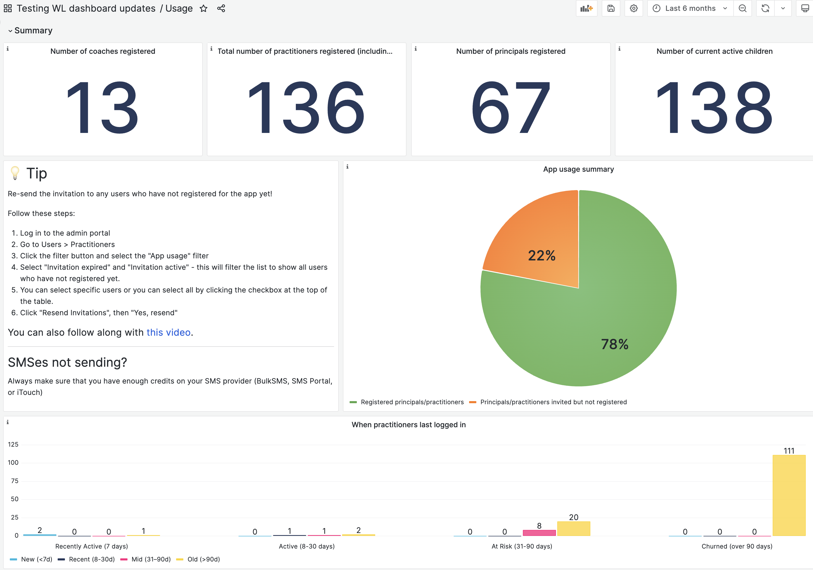
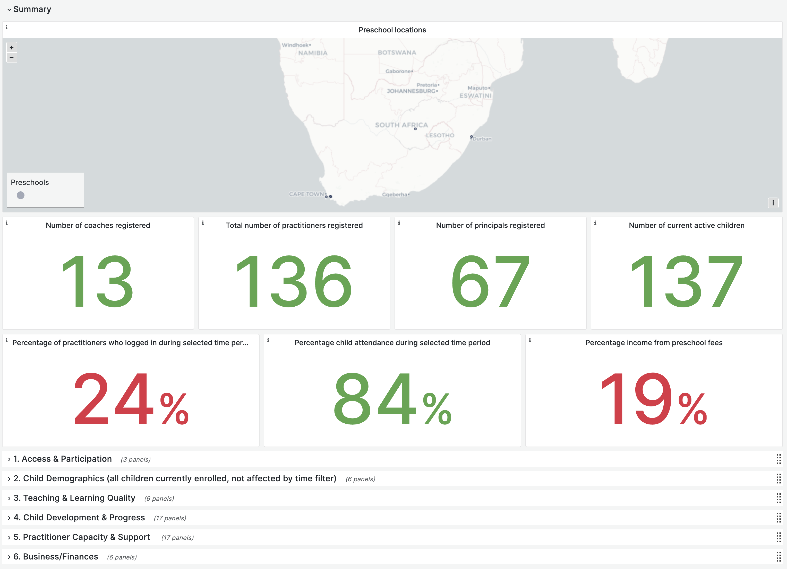
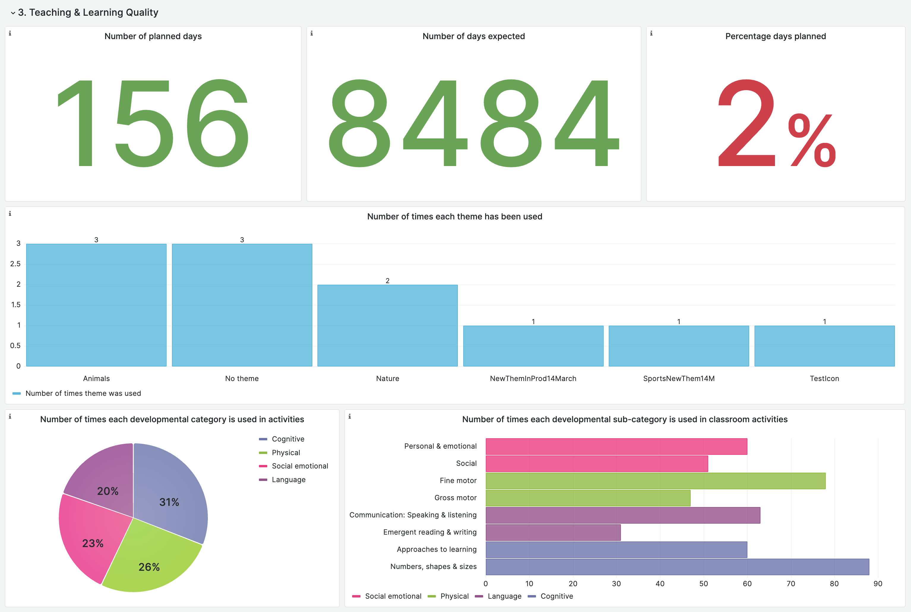
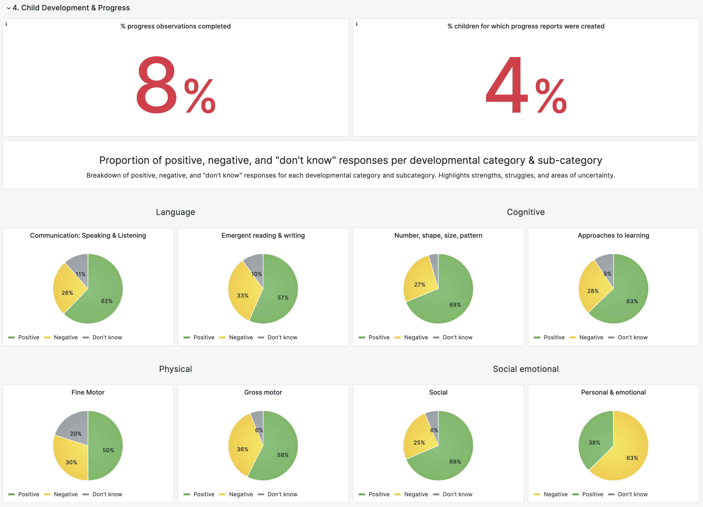
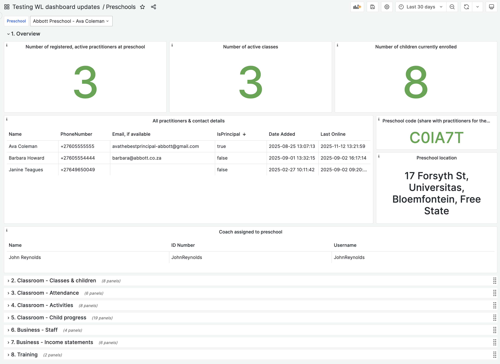

**About the report:** This report (as of 20 November 2025) provides a snapshot of ECD Connect’s reach, usage, and emerging data trends. It highlights key dashboard insights, recent advances in partner data-sharing, and early indications of how this information is beginning to support programme quality and sector learning.

***

## ECD Connect Data Progress

We have made strong progress in how we analyse and share data across education and health, giving partners clearer, more actionable insight into uptake, delivery, and user behaviour.

- Dashboards highlight key patterns in retention, engagement, service delivery, and outcomes.
We have made app improvements in direct response to emerging data signals and user behaviour.
- Data now highlights outcomes at child, preschool, and clinic level, helping partners see emerging patterns across their networks.

These advances strengthen ECD Connect’s core purpose: a user-centred system that also delivers the insight needed for effective scale. As usage grows, it positions the sector to connect partner datasets (including ECD Connect and Funda App) with larger systems and contribute to a more coherent national ECD data ecosystem.
<br>

***

## Overall Reach and Scale

ECD Connect has grown rapidly across both education and health since launch. The figures below show our overall footprint to date, reflecting adoption across ECD Connect App (open access), ECD Connect Partner (white label versions), and Grow Great’s CHW Connect.

::: {.stat-block}

::: {.stat-card}
<p class="stat-number">4</p>
<p class="stat-label">partner organisations</p>
:::

::: {.stat-card}
<p class="stat-number">2,455</p>
<p class="stat-label">unique user sign-ups</p>
:::

::: {.stat-card}
<p class="stat-number">12,836</p>
<p class="stat-label">children registered</p>
:::

:::

***

## CHW Connect (Grow Great Champions)

::: {.stat-block}

::: {.stat-card .gg-background}
<p class="stat-number">342</p>
<p class="stat-label">Community Health Workers</p>
:::

::: {.stat-card .gg-background}
<p class="stat-number">60 808</p>
<p class="stat-label">child visits <br>(Apr 2024-Nov 2025)</p>
:::

::: {.stat-card .gg-background}
<p class="stat-number">6 503</p>
<p class="stat-label">pregnant client visits <br>(Apr 2024-Nov 2025)</p>
:::

:::

### User Retention

- **79%** of CHWs who joined the app over 30 days ago have logged in again after 30 days.
- **30%** of CHWs who signed up over 30 days ago have logged in within the past month.

### Visits Completed per Month (Nov 2024 to Nov 2025)
_The peaks in activity reflect periods when pilots were active; the later decline follows the pilots ending in Gauteng and Limpopo._

```{r gg-visits-bar, echo=FALSE}
#| message: false
#| warning: false
#| paged-print: true
#| out.width: 100%

library(tidyverse)
library(sf)
library(dplyr)
library(ggplot2)
library(conflicted)
library(stringr)
library(patchwork)
library(scales)
library(viridis)
library(lubridate)
library(readr)
library(leaflet)
library(plotly)
library(gt)
library(tidyr)
library(knitr)
library(kableExtra)
library(gtExtras)

visits <- read_csv("~/Desktop/data/visits.csv")

# Order months chronologically
visits$Month <- factor(visits$Month, levels = unique(visits$Month))

# Ensure Visit Type order (bottom first)
visits$`Visit Type` <- factor(
  visits$`Visit Type`,
  levels = c("Number of pregnant client visits", "Number of child visits")
)

# Stacked bar chart with reversed legend order
ggplot(visits, aes(x = Month, y = `Visits Completed`, fill = `Visit Type`)) +
  geom_bar(stat = "identity", colour = "white", width = 0.8) +
  scale_fill_manual(
    values = c(
      "Number of pregnant client visits" = "#FF2180",  # pink (top)
      "Number of child visits" = "#1DBADF"             # teal (bottom)
    ),
    breaks = c("Number of child visits", "Number of pregnant client visits") # ensures correct legend order
  ) +
  labs(
    x = NULL,
    y = "Visits Completed",
    fill = NULL
  ) +
  theme_minimal(base_size = 12) +
  theme(
    panel.grid.minor = element_blank(),
    axis.text.x = element_text(angle = 45, hjust = 1),
    plot.title = element_text(face = "bold"),
    legend.position = "bottom",
    legend.box.margin = margin(t = -10),
    legend.text = element_text(size = 10)
  )
```

<br>

#### Active CHWs and Average Visits per Month (Nov 2024 to Nov 2025)
_An **active CHW** is a user who completed at least one visit that month._

```{r gg-visits-chws, echo=FALSE}
#| message: false
#| warning: false
#| paged-print: true
#| out-width: "100%"

data <- read_csv("~/Desktop/data/avg-visits-chws.csv")

# Convert Month to date format
data <- data %>%
  mutate(Month = as.Date(Month))

# Plot
ggplot(data, aes(x = Month)) +
geom_line(
aes(y = `Number of active CHWs`,
colour = "Active CHWs",
linetype = "Active CHWs"),
linewidth = 1.2
) +
geom_line(
aes(y = `Avg number of visits per active CHW`,
colour = "Avg Number of Visits per CHW",
linetype = "Avg Number of Visits per CHW"),
linewidth = 1.2
) +
scale_colour_manual(
name = NULL,
values = c(
"Active CHWs" = "#1DBADF",
"Avg Number of Visits per CHW" = "#FF2180"
)
) +
scale_linetype_manual(
name = NULL,
values = c(
"Active CHWs" = "solid",
"Avg Number of Visits per CHW" = "11"
)
) +
labs(
x = "Month",
y = "Count / Average"
) +
theme_minimal(base_size = 12) +
theme(
panel.grid.minor = element_blank(),
legend.position = "right"
) +
scale_y_continuous(
  breaks = pretty,
  expand = expansion(mult = c(0, 0.3))) +
labs(
x = "Month",
y = "Count / Average"
) +
theme_minimal(base_size = 12) +
theme(
panel.grid.minor = element_blank(),
legend.position = c(0.05, 0.95), # top-left inside plot
legend.justification = c("left", "top"),
legend.background = element_rect(fill = alpha("white", 0.7),
colour = NA),
legend.key = element_blank()
)

```

***

## ECD Connect App (Open Access)
_A version of the app that is open to any principal/practitioner working in ECD in South Africa. Since launch in April 2025 to November 2025_

::: {.stat-block}

::: {.stat-card .app-background}
<p class="stat-number">1,902</p>
<p class="stat-label">unique sign-ups</p>
:::

::: {.stat-card .app-background}
<p class="stat-number">608</p>
<p class="stat-label">preschools added</p>
:::

::: {.stat-card .app-background}
<p class="stat-number">1,667</p>
<p class="stat-label">children registered</p>
:::

:::

### User Retention
- **16%** of users who joined the app over 30 days ago have logged in again after 30 days. This is higher than the standard [global app retention rate of 7% by day 30](https://www.adjust.com/resources/guides/user-retention/).
- **9%** of practitioners who signed up over 30 days ago have logged in within the past month.

### Attendance registers saved
_As we roll out to more users, we are seeing an increase in the number of attendance registers saved per month._

```{r app-attendance-bar, echo=FALSE}
#| message: false
#| warning: false
#| paged-print: true
#| out.width: 100%

df_appattendance <- read.csv("~/Desktop/data/app-attendance2.csv", stringsAsFactors = FALSE)

df_appattendance <- df_appattendance %>%
  mutate(
    # Parse your "YYYY-MM" into a proper Date
    MonthDate = ym(month)  # lubridate::ym() interprets "2025-04" as 2025-Apr-01
  )

ggplot(df_appattendance, aes(x = MonthDate, y = registers)) +
  geom_col(fill = "#83BB26") +
  scale_x_date(
  date_labels = "%b %Y",   # 👈 shows "Apr 2025" instead of "April 2025"
  date_breaks = "1 month"
) +
  labs(
    x = "Month",
    y = "Number of registers saved"
  ) +
  theme_minimal() +
  theme(axis.text.x = element_text(angle = 45, hjust = 1))
```

***

## ECD Connect Partner (White Label)
_A customisable version for organisations who want to use an organisation-branded version of the app within their networks. We currently have versions for: Khululeka, Ntataise, and True North. Since launch in October 2024 to November 2025._

::: {.stat-block}

::: {.stat-card .partner-background}
<p class="stat-number">226</p>
<p class="stat-label">unique sign-ups</p>
:::

::: {.stat-card .partner-background}
<p class="stat-number">61</p>
<p class="stat-label">preschools added</p>
:::

::: {.stat-card .partner-background}
<p class="stat-number">1,020</p>
<p class="stat-label">children registered</p>
:::

:::

### User Retention
- **26%** of users who joined the app over 30 days ago have logged in again after 30 days.
- **13%** of practitioners who signed up over 30 days ago have logged in within the past month.

### Attendance registers saved
_Spikes in attendance tracking align with partner outreach periods, reflecting stronger engagement during those months._

```{r partner-attendance-bar, echo=FALSE}
#| message: false
#| warning: false
#| paged-print: true
#| out.width: 100%

df_appattendance <- read.csv("~/Desktop/data/partner-attendance.csv", stringsAsFactors = FALSE)

df_appattendance <- df_appattendance %>%
  mutate(
    # Parse your "YYYY-MM" into a proper Date
    MonthDate = ym(month)  # lubridate::ym() interprets "2025-04" as 2025-Apr-01
  )

ggplot(df_appattendance, aes(x = MonthDate, y = registers)) +
  geom_col(fill = "#FFD525") +
  scale_x_date(
  date_labels = "%b %Y",   # 👈 shows "Apr 2025" instead of "April 2025"
  date_breaks = "1 month"
) +
  labs(
    x = "Month",
    y = "Number of registers saved"
  ) +
  theme_minimal() +
  theme(axis.text.x = element_text(angle = 45, hjust = 1))
```


<br>
<br>
<br>
<br>

***

::: {.callout-note collapse="true"}

# Appendix 1 - How ECD Connect Partner Organisations View App Data

## ECD Connect Partner - Grafana Dashboards

Each partner organisation has access to three Grafana dashboards where they can see live data from their version of the app.

### Usage dashboard
For user support team members. It allows team members to monitor usage and quickly help users when needed.

```{r}
#| echo: false
#| fig-cap: "Image of usage dashboard, showing test environment data."

```

### Outcomes dashboard
Shows outcomes in six categories: Access & Participation, Child Demographics, Teaching & Learning Quality, Child Development & Progress, Practitioner Capacity & Support, Business/Finances. This dashboard will be adapted and expanded in collaboration with partner organisations.

```{r}
#| echo: false
#| fig-cap: "Image of outcomes dashboard, showing test environment data."


```

```{r}
#| echo: false
#| fig-cap: "Teaching and learning section - showing test environment data."

```

```{r}
#| echo: false
#| fig-cap: "Child development section - showing test environment data."

```

### Preschools dashboard
Shows preschool-level information and allows organisations to identify and respond to preschool-level issues. Organisations can filter to view a specific preschool

```{r}
#| echo: false
#| fig-cap: "Image of preschools dashboard, showing test environment data."


```
:::

::: {.callout-note collapse="true"}

# Appendix 2 - Emerging Insights

## Education - Emerging Insights
_As use of the education app expands, richer patterns are emerging in the data being captured - from child demographics and attendance to preschool business trends. The visuals below provide early insight into how the platform reflects real-world programme participation and operations._

### 1. Child demographics

#### Geographic Spread of Registered Children

```{r ed-children-map, echo=FALSE}
#| message: false
#| warning: false
#| paged-print: true

# --- Load shapefile ---
districts <- st_read("~/Desktop/data/DistrictMunicipalities2018_Final.shp", quiet = TRUE) %>%
  st_transform(4326)

# Standardise fields for join
districts <- districts %>%
  mutate(
    DISTRICT_NAME_clean = trimws(toupper(DISTRICT_N)),
    PROVINCE_clean = trimws(toupper(PROVINCE))
  )

# --- Load required CSVs + spatial data ---
codes <- read_csv("~/Desktop/data/codes-ed.csv")
load("~/Desktop/data/postalcodes_geo.rda")

# --- Prepare postal code coordinates ---
codes_geo <- codes %>%
  mutate(PostalCode = as.character(PostalCode)) %>%
  left_join(
    postalcodes_geo %>% mutate(code = as.character(code)),
    by = c("PostalCode" = "code")
  ) %>%
  drop_na(lat, lon)

# --- Convert to spatial points ---
codes_sf <- st_as_sf(codes_geo, coords = c("lon", "lat"), crs = 4326)

# --- Spatially join points → districts (GET DISTRICT + PROVINCE HERE) ---
codes_sf_with_districts <- st_join(
  codes_sf,
  districts %>% select(DISTRICT_N, PROVINCE),
  join = st_within
)

leaflet() %>%
  addProviderTiles("CartoDB.Positron") %>%
  addPolygons(
    data = districts,
    color = "#666", weight = 1, fillOpacity = 0.1
  ) %>%
  addCircleMarkers(
    data = codes_sf_with_districts,
    radius = ~scales::rescale(TotalChildren, to = c(2, 12)),
    color = "#1DBADF", fillOpacity = 0.8, stroke = FALSE,
    popup = ~paste0(
      "<b>Total children:</b> ", TotalChildren, "<br>",
      "<b>District:</b> ", DISTRICT_N, "<br>",
      "<b>Province:</b> ", PROVINCE
    )
  ) %>%
  setView(lng = 25, lat = -29, zoom = 5)


```

#### Child Gender Distribution

``` {r ed-children-gender, echo=FALSE }
#| warning: false
#| message: false

conflicted::conflicts_prefer(plotly::layout)

# Load data
gender_data <- read_csv("~/Desktop/data/child-gender.csv")

# Prepare data
gender_data <- gender_data %>%
  arrange(desc(count)) %>%
  mutate(
    gender = factor(gender, levels = gender),
    Percentage = round(count / sum(count) * 100, 1)
  )

# Create interactive pie
plot_ly(
  data = gender_data,
  labels = ~gender,
  values = ~count,
  type = "pie",
  sort = FALSE,
  direction = "clockwise",
  textinfo = "label+percent",
  textposition = "auto",
  hoverinfo = "text",
  text = ~paste(gender, ": ", Percentage, "%"),
  marker = list(
    colors = c("#83BB26", "#1DBADF", "#FFD525"),
    line = list(color = "white", width = 2)
  )
) %>%
  layout(
  showlegend = FALSE,
  uniformtext = list(minsize = 12, mode = "hide"),
  startangle = 90,
  margin = list(l = 0, r = 0, t = 10, b = 0),
  automargin = TRUE,
  autosize = TRUE,
  height = NULL,
  width = NULL,
  piecolorway = c("#83BB26", "#1DBADF", "#FFD525"),
  annotations = list(),
  # 👇 this is what enables the leader (connector) lines
  showlegend = FALSE,
  # Important connector line setting:
  newshape = list(line = list(color = "grey", width = 1))
) %>%
  config(responsive = TRUE)


```

#### Child Age Distribution

``` {r ed-children-ages, echo=FALSE, fig.height = 8 }
#| warning: false
#| message: false

# Read the CSV

age_data <- read_csv("~/Desktop/data/age-groups-ed.csv")

# Create the bar chart
ggplot(age_data, aes(x = `Age Group`, y = `Number of Children`)) +
geom_col(fill = "#1DBADF") +
labs(x = "Age Group",
y = "Number of children") +
theme_minimal(base_size = 13) +
theme(
plot.title = element_text(face = "bold", hjust = 0.5),
axis.text.x = element_text(angle = 30, hjust = 1)
)
```

#### Family Grant Types

```{r grants-ed, echo=FALSE}
#| warning: false
#| message: false

# Load data
grants <- read_csv("~/Desktop/data/grants-ed.csv")

# Clean up labels
grants <- grants %>%
  mutate(type = recode(type,
                       "None selected" = "No response"))

# Plot
ggplot(grants, aes(x = fct_reorder(type, number_of_children), 
                   y = number_of_children)) +
  geom_col(fill = "#1DBADF", show.legend = FALSE) +
  coord_flip() +
  labs(
    x = NULL,
    y = "Number of children"
  ) +
  theme_minimal(base_size = 13)
```

#### Additional Data Collected
- Primary caregiver's relationship to child (mother, father, grandparent, etc.)
- Home languages
- Allergies, disabilities, health conditions (free text)
- Primary caregiver's highest level of education
<br>


### 2. Access & Participation

<br>

#### Average Child Attendance by Month

```{r child-attendance, echo=FALSE}
#| warning: false
#| message: false

# --- Load and prepare data ---
attendance <- read_csv("~/Desktop/data/child-attendance.csv") %>%
  arrange(month_start)

# --- Plot ---
ggplot(attendance, aes(x = reorder(Month, month_start),
                       y = `Percentage child attendance`)) +
  geom_col(fill = "#FF2180") +                           # ECD Connect teal
  geom_text(aes(label = paste0(round(`Percentage child attendance`, 0), "%")),
            vjust = -0.5, size = 3.2, colour = "#004C6D") +  # navy text
  scale_y_continuous(labels = label_percent(scale = 1)) +
  labs(
    x = NULL,
    y = "Child attendance (%)"
  ) +
  theme_minimal(base_size = 12) +
  theme(
    plot.title = element_text(face = "bold", colour = "#004C6D"),
    axis.text.x = element_text(angle = 45, hjust = 1),
    panel.grid.minor = element_blank()
  )
```

#### Additional Data Collected
- Child's start and end date at preschool
- When a child is deregistered, we capture the reason for removal

<br>

### 3. Business & Finance

#### Spread of Preschool Balances (Apr to Nov 2025)
_Balance is income minus expenses_

```{r balances-table, echo=FALSE}
#| warning: false
#| message: false

options(readr.show_col_types = FALSE)

invisible (balances <- suppressMessages(suppressWarnings(
  readr::read_csv("~/Desktop/data/balances2-ed.csv", show_col_types = FALSE)
))
)

# Remove outliers
balances_clean <- dplyr::filter(
  balances,
  balance > mean(balance) - 3*sd(balance),
  balance < mean(balance) + 3*sd(balance)
)

# Compute summary stats (no range)
summary_stats <- balances_clean %>%
  summarise(
    `Total Preschools` = n(),
    `Mean Balance (R)` = mean(balance),
    `Median Balance (R)` = median(balance),
    `Minimum Balance (R)` = min(balance),
    `Maximum Balance (R)` = max(balance)
  ) %>%
  mutate(across(where(is.numeric), round, 0))

# Pretty table
summary_stats %>%
  gt() %>%
  fmt_number(
    columns = everything(),
    decimals = 0,
    use_seps = TRUE
  ) %>%
  tab_options(
    table.font.size = 14,
    heading.title.font.size = 16,
    table.border.top.width = 0,
    table.border.bottom.width = 0
  )

```

<br>

```{r balances-density, echo=FALSE}

#| warning: false
#| message: false

# Read in the data
balances <- read_csv("~/Desktop/data/balances2-ed.csv")

# Create histogram (one extreme outlier removed - user submitted the same income 3 times)
balances_clean <- dplyr::filter(
  balances,
  balance > mean(balance) - 3*sd(balance),
  balance < mean(balance) + 3*sd(balance)
)

ggplot(balances_clean, aes(x = balance)) +
  geom_histogram(binwidth = 3000, fill = "#27385A", colour = "white") +
  scale_x_continuous(labels = comma, breaks = pretty_breaks(n = 7)) +
  scale_y_continuous(labels = comma) +
  labs(
    x = "Balance (R)",
    y = "Number of Preschools"
  ) +
  theme_minimal()
```

<br>

#### Income and Expense Categories (Apr to Nov 2025)
_Percentage breakdown of income and expense categories during the selected period. Each pie shows the share of total income or total expenses contributed by each category._

::: {style="width:100%"}

``` {r expense-income-types, echo=FALSE}
#| warning: false
#| message: false

conflicted::conflicts_prefer(plotly::layout)

# --- Income ---
income_data <- read_csv("~/Desktop/data/income-types.csv") %>%
  arrange(desc(Percentage)) %>%
  mutate(Category = factor(Category, levels = Category))

p1 <- plot_ly(
  data = income_data,
  labels = ~Category,
  values = ~Percentage,
  type = "pie",
  sort = FALSE,
  direction = "clockwise",
  textinfo = "label+percent",
  textposition = "auto",
  hoverinfo = "text",
  text = ~paste(Category, ": ", Percentage, "%"),
  marker = list(
    colors = c("#1DBADF", "#FF2180", "#FFD525", "#83BB26", "#27385A"),
    line = list(color = "white", width = 2)
  ),
  domain = list(x = c(0, 0.48))  # left half
) %>%
  plotly::layout(
    showlegend = FALSE,
    uniformtext = list(minsize = 12, mode = "hide"),
    startangle = 90,
    margin = list(l = 0, r = 0, t = 80, b = 0),
    automargin = TRUE,
    autosize = TRUE,
    width = NULL,
    height = 500
  )

# --- Expenses ---
expense_data <- read_csv("~/Desktop/data/expense-types.csv") %>%
  arrange(desc(Percentage)) %>%
  mutate(Category = factor(Category, levels = Category))

p2 <- plot_ly(
  data = expense_data,
  labels = ~Category,
  values = ~Percentage,
  type = "pie",
  sort = FALSE,
  direction = "clockwise",
  textinfo = "label+percent",
  textposition = "auto",
  hoverinfo = "text",
  text = ~paste(Category, ": ", Percentage, "%"),
  marker = list(
    colors = c("#1DBADF", "#FF2180", "#FFD525", "#83BB26", "#27385A", "#8EDCEF", "#FF90BF"),
    line = list(color = "white", width = 2)
  ),
  domain = list(x = c(0.52, 1))  # right half
) %>%
  plotly::layout(
    showlegend = FALSE,
    uniformtext = list(minsize = 12, mode = "hide"),
    startangle = 90,
    margin = list(l = 0, r = 0, t = 80, b = 0),
    automargin = TRUE,
    autosize = TRUE,
    width = NULL,
    height = 500
  )

# --- Combine side by side ---
combined <- subplot(p1, p2, widths = c(0.5, 0.5)) %>%
  layout(
    margin = list(b = 120, t = 80),  # add bottom space
    annotations = list(
      list(
        text = "Income Types",
        x = 0.16,   # centre under left pie
        y = -0.10,  # move below chart
        xref = "paper",
        yref = "paper",
        showarrow = FALSE,
        font = list(size = 16)
      ),
      list(
        text = "Expense Types",
        x = 0.83,   # centre under right pie
        y = -0.10,
        xref = "paper",
        yref = "paper",
        showarrow = FALSE,
        font = list(size = 16)
      )
    )
  )

combined


```

:::

<br>

#### DBE Subsidy
_Subsidy information - April to November 2025._

::: {.stat-block}

::: {.stat-card}
<p class="stat-number">17</p>
<p class="stat-label">preschools logged DBE subsidy</p>
:::

::: {.stat-card}
<p class="stat-number">R 88,275</p>
<p class="stat-label">average DBE subsidy amount received</p>
:::

::: {.stat-card}
<p class="stat-number">R 63,536</p>
<p class="stat-label">median DBE subsidy amount</p>
:::

::: {.stat-card}
<p class="stat-number">52</p>
<p class="stat-label">children covered on average</p>
:::

::: {.stat-card}
<p class="stat-number">15</p>
<p class="stat-label">minimum number of children covered</p>
:::

::: {.stat-card}
<p class="stat-number">100</p>
<p class="stat-label">maximum number of children covered</p>
:::

:::

<br>

#### Preschool Fees
_Preschool fee information- April to November 2025._

::: {.stat-block}

::: {.stat-card}
<p class="stat-number">36</p>
<p class="stat-label">preschools logged preschool fees</p>
:::

::: {.stat-card}
<p class="stat-number">R 438</p>
<p class="stat-label">average preschool fee amount received per child</p>
:::

::: {.stat-card}
<p class="stat-number">70.1%</p>
<p class="stat-label">average % of children who paid preschool fees per month (out of all children at preschools where fees were logged)</p>
:::

:::

<br>

#### Additional data collected
Alongside the summaries shown above, the following fields are also recorded when preschools log their income and expenses:

- Month and year of each entry
- Amount captured
- Child identifier for preschool fee payments
- Donation type (where applicable)
- Notes added by the preschool
- Uploaded images for expense items (receipts/invoices)
- Whether a financial statement was downloaded


### 4. Teaching & Learning

#### Lesson planning
The classroom activities and resources sections of the app have generated a lot of interest.

::: {.stat-block}

::: {.stat-card}
<p class="stat-number">221</p>
<p class="stat-label">users have used the lesson planning tool</p>
:::

::: {.stat-card}
<p class="stat-number">31</p>
<p class="stat-label">average number of days planned per practitioner (counting practitioners who have used the lesson planning tool at least once)</p>
:::

:::

#### Child Progress Tracking
_Adoption of the child progress tool has been slower, but an increasing number of preschools are using the tool._

::: {.stat-block}

::: {.stat-card}
<p class="stat-number">40</p>
<p class="stat-label">preschools have used the child progress tracking tool</p>
:::

:::

#### Child Developmental Outcomes by Subcategory

```{r progress2, echo=FALSE}

#| warning: false
#| message: false

# Read CSV
data <- read_csv("~/Desktop/data/child-outcomes-developmental-areas.csv")

# Convert to long format
data_long <- pivot_longer(data,
                          cols = c("Positive", "Negative", "Don't know"),
                          names_to = "Response",
                          values_to = "Count")

# ECD Connect colours
ecd_colours <- c("#1DBADF", "#FF2180", "#FFD525", "#83BB26", "#27385A", "#8EDCEF", "#FF90BF")

# Assign colours to responses
response_colours <- c("Positive" = "#83BB26",
                      "Negative" = "#FF2180",
                      "Don't know" = "#1DBADF")

# Horizontal stacked bar chart
ggplot(data_long, aes(y = SubcategoryName, x = Count, fill = Response)) +
  geom_bar(stat = "identity") +
  scale_fill_manual(values = response_colours) +
  labs(
       x = "Number of Skills",
       y = "Developmental Subcategory",
       fill = "Response") +
  theme_minimal() +
  theme(axis.text.y = element_text(size = 9),
        legend.position = "bottom")


```

---

Beyond in-app data, we also learn from our user support process. Practitioners contact our WhatsApp line, where simple queries are handled automatically and more complex issues receive human support. This channel has enabled us to quickly distribute surveys and organise phone interviews with users. Over time, it will give us richer insights into user behaviour and the broader ECD landscape.

---


## Health (CHW Connect)

### 1. Client Demographics
_Demographics of all clients added since launch_

#### Number of CHWs and Clients Added per Province
```{r province-clients, echo=FALSE}
#| warning: false
#| message: false

df <- read_csv("~/Desktop/data/clients-by-province.csv")

# Clean column names exactly as they appear in your CSV
df_clean <- df %>%
  rename(
    Province = Province,
    CHWs = CHWs,
    "Pregnant clients" = `Pregnant Clients Added`,
    "Child clients" = `Child Clients Added`
  ) %>%
  select(Province, CHWs, "Pregnant clients", "Child clients")

# Pivot to long format
df_long <- df_clean %>%
  pivot_longer(
    cols = c(CHWs, "Pregnant clients", "Child clients"),
    names_to = "Metric",
    values_to = "Value"
  ) %>%
  mutate(
    Metric = factor(Metric, levels = c("CHWs", "Pregnant clients", "Child clients")),
    Value = ifelse(Value == 0, 0.01, Value)  # optional – prevents invisible bars
  )

# ECD Connect colours
ecd_cols <- c(
  "CHWs" = "#1DBADF",     # teal blue
  "Pregnant clients" = "#FF2180", # bright pink
  "Child clients" = "#FFD525"     # yellow
)

ggplot(df_long, aes(x = Province, y = Value, fill = Metric)) +
  geom_col(position = position_dodge(width = 0.8)) +
  scale_fill_manual(values = ecd_cols) +
  labs(
    y = "Count",
    x = "Province",
    fill = ""
  ) +
  theme_minimal(base_size = 12) +
  theme(
    plot.title = element_text(face = "bold"),
    axis.text.x = element_text(angle = 30, hjust = 1)
  )

```

#### Child Gender Distribution
``` {r gg-children-gender, echo=FALSE }
#| warning: false
#| message: false

conflicted::conflicts_prefer(plotly::layout)

# Load data
gender_data <- read_csv("~/Desktop/data/gg-gender.csv")

# Prepare data
gender_data <- gender_data %>%
  arrange(desc(count)) %>%
  mutate(
    gender = factor(gender, levels = gender),
    Percentage = round(count / sum(count) * 100, 1)
  )

# Create interactive pie
plot_ly(
  data = gender_data,
  labels = ~gender,
  values = ~count,
  type = "pie",
  sort = FALSE,
  direction = "clockwise",
  textinfo = "label+percent",
  textposition = "auto",
  hoverinfo = "text",
  text = ~paste(gender, ": ", Percentage, "%"),
  marker = list(
    colors = c("#83BB26", "#1DBADF", "#FFD525"),
    line = list(color = "white", width = 2)
  )
) %>%
  layout(
  showlegend = FALSE,
  uniformtext = list(minsize = 12, mode = "hide"),
  startangle = 90,
  margin = list(l = 0, r = 0, t = 10, b = 0),
  automargin = TRUE,
  autosize = TRUE,
  height = NULL,
  width = NULL,
  piecolorway = c("#83BB26", "#1DBADF", "#FFD525"),
  annotations = list(),
  # 👇 this is what enables the leader (connector) lines
  showlegend = FALSE,
  # Important connector line setting:
  newshape = list(line = list(color = "grey", width = 1))
) %>%
  config(responsive = TRUE)


```

#### Birth Cohorts of Active Children
```{r birth-cohorts, echo=FALSE }
#| warning: false
#| message: false

# ---- Load your real data ----
df <- read_csv("~/Desktop/data/gg-ages.csv")

# Expecting columns:
# birth_period   count

# ---- ECD Connect colours ----
ecd_cols <- c(
  teal_blue = "#1DBADF",
  pink = "#FF2180",
  yellow = "#FFD525",
  green = "#83BB26",
  navy = "#27385A",
  light_teal = "#8EDCEF",
  light_pink = "#FF90BF"
)

# ---- Ordering: year desc, Jul–Dec above Jan–Jun ----
df <- df %>%
  mutate(
    year = as.integer(str_sub(birth_period, -4)),
    half = if_else(str_detect(birth_period, "Jul–Dec"), 2, 1),
    birth_period = fct_reorder(birth_period, year*10 + half)
  )

# ---- Plot ----
ggplot(df, aes(x = birth_period, y = count)) +
  geom_col(fill = ecd_cols["teal_blue"]) +
  geom_text(aes(label = count), vjust = -0.4, size = 3.2) +
  scale_y_continuous(expand = expansion(mult = c(0, .15))) +
  labs(
    x = "",
    y = "Count"
  ) +
  theme_minimal(base_size = 13) +
  theme(
    plot.title = element_text(face = "bold", colour = ecd_cols["navy"]),
    plot.subtitle = element_text(colour = ecd_cols["navy"]),
    axis.text.x = element_text(angle = 45, hjust = 1, colour = ecd_cols["navy"]),
    axis.title.y = element_text(colour = ecd_cols["navy"]),
    panel.grid.minor = element_blank()
  )
```


#### Stunting Prevalance by Month
_The Grow Great team is able to view stunting rates alongside the number of child visits completed; as well as filtered by province/district, etc. The graph below is showing stunting prevalence by month, across all areas._

```{r stunting, echo=FALSE}

#| warning: false
#| message: false

# Read CSV
stunting <- read_csv("~/Desktop/data/stunting.csv")

# Plot

ggplot(stunting, aes(x = Month, y = `Stunting Prevalence %`)) +
  geom_col(fill = "#1DBADF") +  # Teal blue
  geom_text(aes(label = paste0(`Stunting Prevalence %`, "%")),
            vjust = -0.3, size = 3.5, colour = "#27385A") +  # Navy text
  labs(
    x = NULL,
    y = "Stunting Prevalence (%)"
  ) +
  theme_minimal(base_size = 13) +
  theme(
    plot.title = element_text(colour = "#27385A", face = "bold"),
    axis.text.x = element_text(colour = "#27385A"),
    axis.text.y = element_text(colour = "#27385A"),
    axis.title.y = element_text(colour = "#27385A"),
    panel.grid.minor = element_blank()
  )
```

#### Potential Developmental Concerns Identified
_Percentage of screenings where milestone was not achieved_

``` {r child-development, echo=FALSE}
#| warning: false
#| message: false

df <- read_csv("~/Desktop/data/developmental-screening.csv")

# compute follow-up rate
rates <- df %>%
  pivot_wider(names_from = Response, values_from = Count) %>%
  mutate(
    total = `On track` + `Needs follow-up`,
    followup_rate = `Needs follow-up` / total
  )

ggplot(rates, aes(x = `Developmental Area`, y = followup_rate)) +
  geom_col(fill = "#FF2180") +   # ECD Connect bright pink
  coord_flip() +
  scale_y_continuous(labels = scales::percent_format()) +
  labs(
    x = NULL,
    y = "Needs follow-up (%)"
  ) +
  theme_minimal(base_size = 15)
```

#### Referrals (November 2024 to November 2025)
_Referrals are automatically raised by the app during visits. After the visit, the CHW checks the referral box to indicate whether the referral to the clinic has been made_

::: {.stat-block}

::: {.stat-card}
<p class="stat-number">16,350</p>
<p class="stat-label">referrals raised</p>
:::

::: {.stat-card}
<p class="stat-number">6,681</p>
<p class="stat-label">referrals completed</p>
:::

::: {.stat-card}
<p class="stat-number">2,338</p>
<p class="stat-label">back-referrals completed (feedback from the clinic)</p>
:::

:::


``` {r referrals, echo=FALSE}
#| warning: false
#| message: false


child_df_raw <- read_csv("~/Desktop/data/child-referrals.csv") %>%
  rename(
    Referral.type = `Referral type`,
    Total = Total
  )

# compute the max *before* mutate
max_total <- max(child_df_raw$Total, na.rm = TRUE)

child_df <- child_df_raw %>%
  mutate(
    Bar = purrr::map_chr(
      Total,
      ~ paste(rep("▉", round(.x / max_total * 10)), collapse = "")
    )
  )

gt(child_df) %>%
  gt::text_transform(
    locations = cells_body(columns = Bar),
    fn = function(x) paste0("<span style='color:#1DBADF'>", x, "</span>")
  ) %>%
  tab_header(
    title = "Top 5 Referral Reasons – Children",
    subtitle = "Nov 2024 – Nov 2025"
  ) %>%
  cols_label(
    Referral.type = "Referral reason",
    Total = "Count",
    Bar = "Visual scale"
  ) %>%
tab_options(table.width = pct(100)) %>%
cols_width(Bar ~ px(120)) %>%
tab_style(
  style = cell_text(whitespace = "nowrap"),
  locations = cells_column_labels(columns = Bar)
)

```

``` {r referrals-pregnant, echo=FALSE}
#| warning: false
#| message: false

child_df <- read_csv("~/Desktop/data/pregnant-referrals.csv") %>%
  rename(Referral.type = `Referral type`, Total = Total) %>%
  mutate(
    Bar = purrr::map_chr(
      Total,
      ~ paste(rep("▉", round(.x / max(child_df$Total) * 20)), collapse = "")
    )
  )

gt(child_df) %>%
  gt::text_transform(
    locations = cells_body(columns = Bar),
    fn = function(x) paste0("<span style='color:#1DBADF'>", x, "</span>")
  ) %>%
  tab_header(
    title = "Top 5 Referral Reasons – Pregnant Clients",
    subtitle = "Nov 2024 – Nov 2025"
  ) %>%
  cols_label(
    Referral.type = "Referral reason",
    Total = "Count",
    Bar = "Visual scale"
  ) %>%
tab_options(table.width = pct(100)) %>%
cols_width(Bar ~ px(120)) %>%
tab_style(
  style = cell_text(whitespace = "nowrap"),
  locations = cells_column_labels(columns = Bar)
)

```


:::

<br>

<button onclick="window.print()">Download PDF</button>
